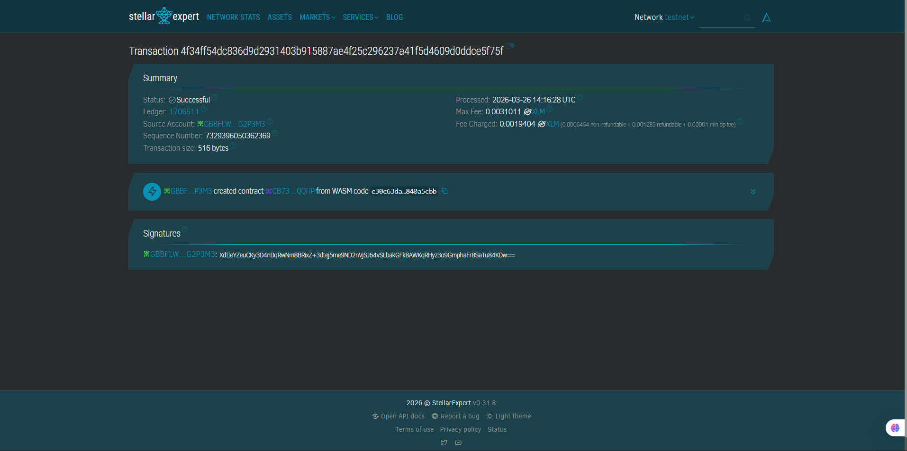

# Stellar Notes DApp 🪐📝

A decentralized note-taking application built on the Stellar network using Soroban smart contracts. This project demonstrates basic CRUD (Create, Read, Delete) operations directly on the blockchain, moving away from traditional centralized databases.

## 🚀 Features
* **Create Notes:** Store text-based notes permanently on the Stellar blockchain.
* **Read Notes:** Retrieve a list of all saved notes securely.
* **Delete Notes:** Remove specific notes from the blockchain storage.
* **Fully Decentralized:** Logic is handled by WebAssembly (WASM) smart contracts, and data is stored immutably on the ledger.

## 🛠 Tech Stack
* **Language:** Rust 🦀
* **Smart Contract Framework:** Soroban SDK
* **Compilation:** WebAssembly (.wasm)
* **Infrastructure:** Stellar CLI & Freighter Wallet
* **Network:** Stellar Testnet

## 🌐 Live Deployment
The contract is currently live on the Stellar Testnet. 
* **Contract ID:** `CB73RD5RN3KSZ6GZLFIOSZPU5R7BIFX4JS6H7S223NVM6DHOZRQZQQHP`
* Link Deployment : `https://lab.stellar.org/r/testnet/contract/CB73RD5RN3KSZ6GZLFIOSZPU5R7BIFX4JS6H7S223NVM6DHOZRQZQQHP`

## 💻 Local Setup & Installation

### Prerequisites
Make sure you have the following installed:
1. [Rust](https://www.rust-lang.org/tools/install)
2. Target `wasm32-unknown-unknown` (`rustup target add wasm32-unknown-unknown`)
3. [Stellar CLI](https://developers.stellar.org/docs/build/smart-contracts/getting-started/setup)

### Build the Contract
Clone this repository and build the smart contract into a `.wasm` file:
```bash
stellar contract build

